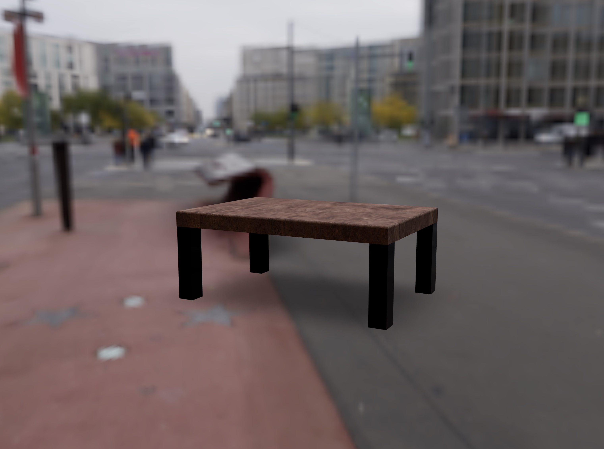
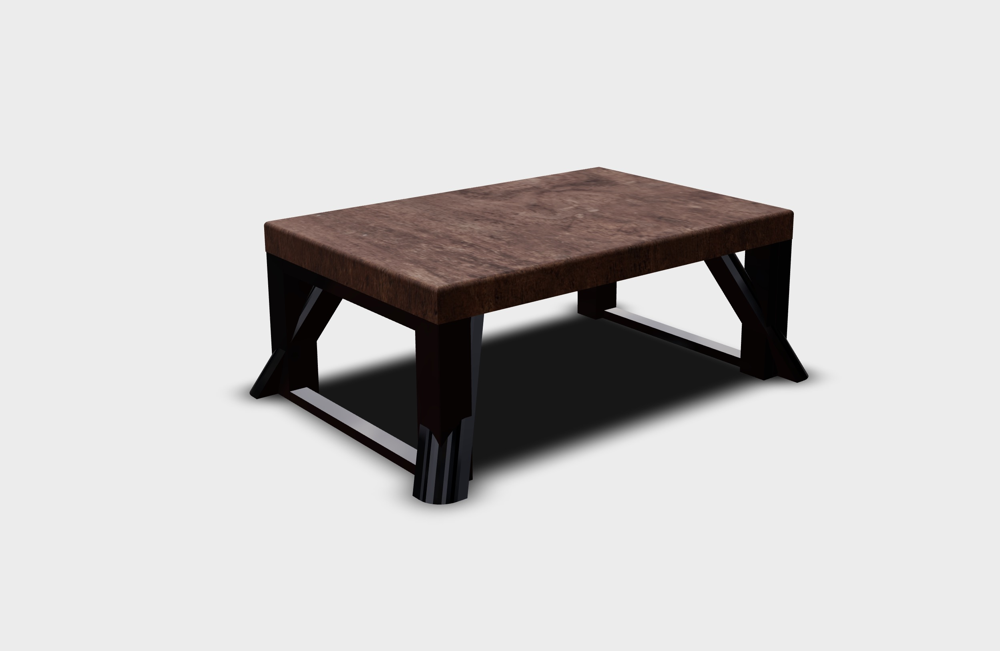
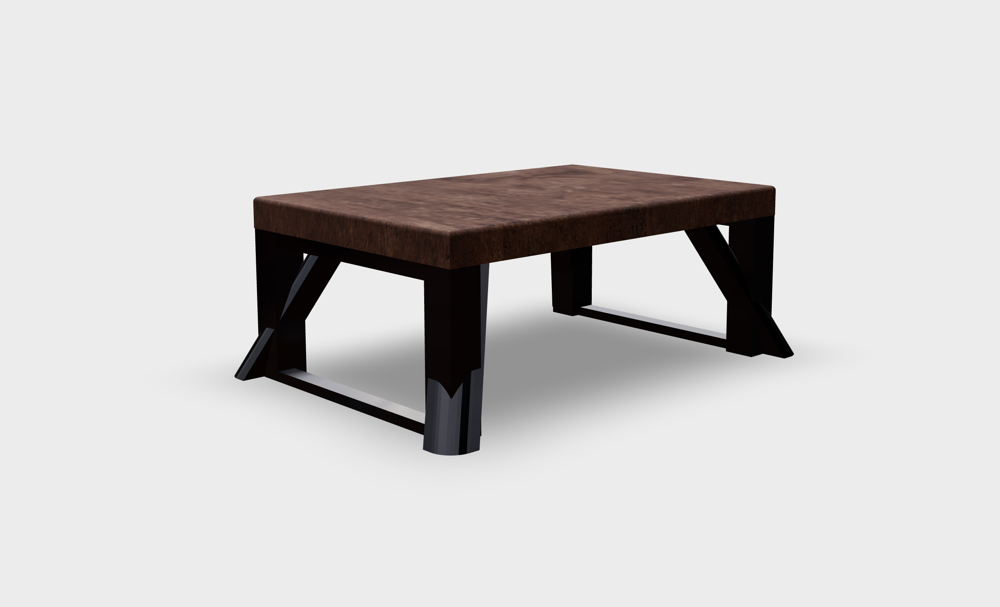
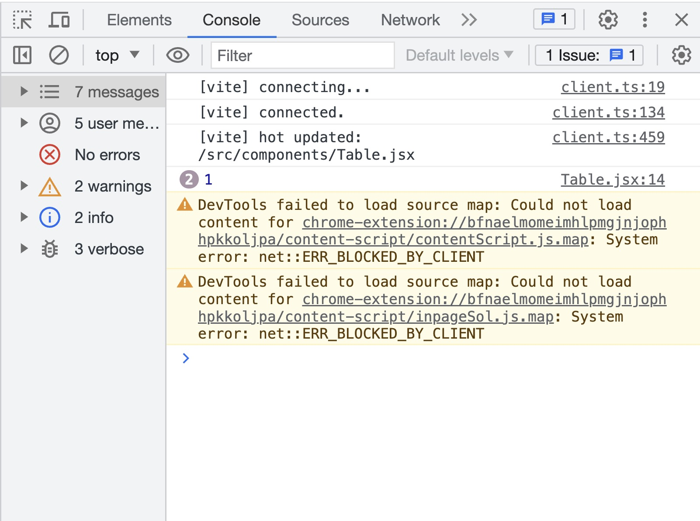
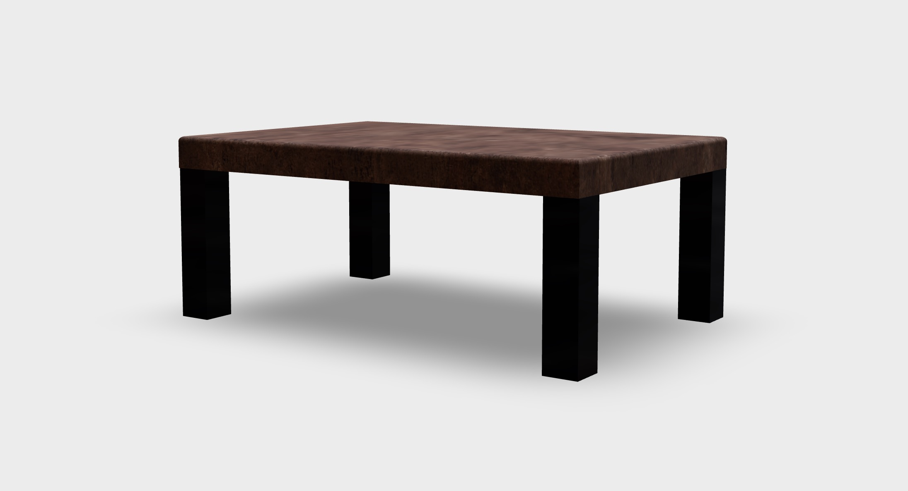
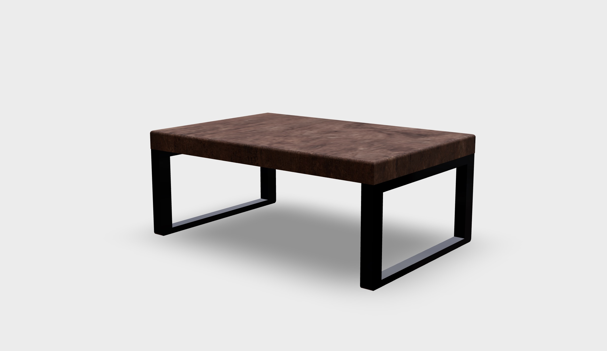

# React Three Fiber で始める

React Three Fiber を使用して、シンプルな 3D テーブル設定ツールを一緒に作成しましょう！

[🇬🇧 EN VERSION](README.md)

以下のように Twitter で `#r3fTokyoMeetup` ハッシュタグを使用して、進行状況やイベントの写真を共有しましょう！また、私のことをメンションしても構いません [@wawasensei](https://twitter.com/wawasensei)。

## プロジェクトのセットアップ

このスタータープロジェクトを実行するには、次のコマンドを実行して依存関係をインストールします：

```bash
yarn
```

その後、開発サーバーを起動するには以下のコマンドを実行します：

```bash
yarn dev
```


_画面の中央に立方体が表示されるはずです。_

## React Three Fiber の超簡単な紹介

以下のコードは `src/components/Experience.jsx` ファイル内で立方体をレンダリングしています：

```jsx
<mesh>
  <boxGeometry />
  <meshStandardMaterial color="white" />
</mesh>
```

_3D_ の世界では、メッシュは **ジオメトリ** と **マテリアル** から構成されるオブジェクトです。

- **ジオメトリ** はオブジェクトの形状を表します。この場合は立方体ですが、球体、平面、円柱などがあります。
- **マテリアル** はオブジェクトの外見を定義します（色、金属質、粗さなど）。この場合は単純なマテリアルで **白色** を表示します。

### 座標軸、位置、回転、スケール

3D 空間では、`x`、`y`、`z` の 3 つの座標軸があります。それぞれの軸は、両方向に無限に延びる線です。


**Three.js**では、座標軸は次のように定義されます：

- `x`：右を指します。
- `y`：上を指します。
- `z`：視聴者の方を指します。

位置を変更することで、立方体を移動させることができます。位置は `[x, y, z]` の配列で指定します：

```jsx
<mesh position={[5, 0, 0]}>
  <boxGeometry />
  <meshStandardMaterial color="white" />
</mesh>
```

回転も同様に行うことができます。

`rotation` の値はラジアンで指定されます。度数からラジアンに変換するには、`THREE.MathUtils.degToRad()` メソッドを使用します：

```jsx
import { OrbitControls } from "@react-three/drei";

import * as THREE from "three";

export const Experience = () => {
  return (
    <>
      <OrbitControls />
      <mesh
        position={[1, 1, 0]}
        rotation={[0, THREE.MathUtils.degToRad(90), 0]}
      >
        <boxGeometry />
        <meshStandardMaterial color="white" />
      </mesh>
    </>
  );
};
```

キューブのスケールを変更することで、キューブのサイズを変更することもできます:

```jsx
<mesh
  position={[1, 1, 0]}
  rotation={[0, THREE.MathUtils.degToRad(90), 0]}
  scale={[0.5, 0.5, 0.5]}
>
  <boxGeometry />
  <meshStandardMaterial color="white" />
</mesh>
```

これは React Three Fiber の最も簡単な紹介です。迷子になっても心配しないでください！このハンズオンワークショップを通じて、一緒にすべてを学んでいきます。

## テーブルモデルの読み込み

シーンに読み込むための**3D テーブルモデル**を使用します。

`table.glb` モデルは `public/models` フォルダに用意されています。

ゼロからコーディングする代わりに、React Three Fiber の作者によって作成された **コマンドラインツール** [gltfjsx](https://github.com/pmndrs/gltfjsx) を使用します。

これにより、モデルをシーンに読み込むためのコードが生成されます：

```bash
npx gltfjsx public/models/table.glb -o src/components/Table.jsx -k -r public
```

`npx` を使用してグローバルにインストールせずに `gltfjsx` を実行します。

`-o` フラグは出力ファイルを指定するために使用されます。この場合は `src/components/Table.jsx` です。

`-k` フラグは **メッシュ** の名前を保持するために使用されます。

`-r` フラグはモデルの **ルート** フォルダを指定するために使用されます。この場合は `public` です。

生成されたコードは次のようになります：

```jsx
/*
Auto-generated by: https://github.com/pmndrs/gltfjsx
Command: npx gltfjsx@6.2.3 public/models/table.glb -o src/components/Table.jsx -k -r public
*/

import React, { useRef } from "react";
import { useGLTF } from "@react-three/drei";

export function Model(props) {
  const { nodes, materials } = useGLTF("/models/table.glb");
  return (
    <group {...props} dispose={null}>
      <mesh
        name="Plate"
        geometry={nodes.Plate.geometry}
        material={materials.Plate}
      />
      <mesh
        name="Legs01Left"
        geometry={nodes.Legs01Left.geometry}
        material={materials.Metal}
        position={[-1.5, 0, 0]}
      />
      <mesh
        name="Legs01Right"
        geometry={nodes.Legs01Right.geometry}
        material={materials.Metal}
        position={[1.5, 0, 0]}
      />
      <mesh
        name="Legs02Left"
        geometry={nodes.Legs02Left.geometry}
        material={materials.Metal}
        position={[-1.5, 0, 0]}
      />
      <mesh
        name="Legs02Right"
        geometry={nodes.Legs02Right.geometry}
        material={materials.Metal}
        position={[1.5, 0, 0]}
      />
      <mesh
        name="Legs03Left"
        geometry={nodes.Legs03Left.geometry}
        material={materials.Metal}
        position={[-1.5, 0, 0]}
      />
      <mesh
        name="Legs03Right"
        geometry={nodes.Legs03Right.geometry}
        material={materials.Metal}
        position={[1.5, 0, 0]}
      />
    </group>
  );
}

useGLTF.preload("/models/table.glb");
```

次に、モデルを読み込むために[React Three Drei ライブラリ](https://github.com/pmndrs/drei)から`useGLTF`フックを使用します。

そして、モデル内の各**メッシュ**に対して、`geometry`、`material`、および`position`を割り当てます。

`Model`コンポーネントを`Experience`コンポーネントにインポートすることができます。さあ、キューブをテーブルに置き換えましょう:

```jsx
import { OrbitControls } from "@react-three/drei";
import { Model } from "./Table";

export const Experience = () => {
  return (
    <>
      <OrbitControls />
      <Model />
    </>
  );
};
```

https://github.com/wass08/meetup-r3f-workshop/assets/6551176/da5b711b-a7fd-44d6-8109-796858399a6e

マウスで**ロードされたテーブルモデル**を回転させながら表示することができます。

_現在、異なるタイプの脚が表示されていますが、**脚の選択機能**を追加する際に修正します。_

## カメラと照明の調整

デフォルトのカメラの位置を変更して、テーブルをより良く見ることができるようにしましょう。

`App.jsx`内で以下のように変更します:

```jsx
<Canvas shadows camera={{ position: [0, 3, 8], fov: 42 }}>
```

照明が暗すぎます。より良い照明を得るために、Environment プリセットを city に変更できます:

```jsx
<Environment preset="city" />
```

`Environment`に`background`プロップを追加することで、適用されたプリセットをプレビューすることもできます:

```jsx
<Environment preset="city" background />
```



_忘れずに、使用後にそれを削除することを忘れないでください..._

## 影

よりリアルな設定をするために、シーンに影を追加します。

[React Three Drei ライブラリ](https://github.com/pmndrs/drei#contactshadows)の`ContactShadows`コンポーネントを使用します。:

```jsx
import { ContactShadows, OrbitControls } from "@react-three/drei";
import { Model } from "./Table";

export const Experience = () => {
  return (
    <>
      <OrbitControls />
      <Model />
      <ContactShadows position={[0, -1, 0]} />
    </>
  );
};
```



うまく機能していますが、影が厳しすぎます！

`blur`プロパティと`opacity`プロパティを変更して、より良い見た目に調整できます。:

```jsx
<ContactShadows position={[0, -1, 0]} blur={3} opacity={0.42} />
```



見た目が良くなりました！

## useConfigurator

アプリ内のどの場所からでも**テーブルの設定**を取得および更新するための**カスタムフック**を作成します。

私たちは、React の[useContext](https://react.dev/reference/react/useContext)フックを使用して、アプリ内のすべてのコンポーネントで利用可能な**コンテキスト**を作成し、[useState](https://react.dev/reference/react/useState)フックを使用して**テーブルの設定**を保存します。

`src/hooks`ディレクトリと`useConfigurator.jsx`という新しいファイルを作成してください。:

```jsx
import { createContext, useContext, useState } from "react";

export const ConfiguratorContext = createContext();

export const ConfiguratorProvider = ({ children }) => {
  const [legs, setLegs] = useState(1);

  return (
    <ConfiguratorContext.Provider value={{ legs, setLegs }}>
      {children}
    </ConfiguratorContext.Provider>
  );
};

export const useConfigurator = () => {
  const context = useContext(ConfiguratorContext);
  if (context === undefined) {
    throw new Error(
      "useConfigurator must be used within a ConfiguratorProvider"
    );
  }
  return context;
};
```

`createContext`関数を使って`ConfiguratorContext`を作成し、`ConfiguratorProvider`コンポーネントを作成しました。このコンポーネントはアプリ全体をラップし、**テーブルの設定**をすべてのコンポーネントで利用できるようにします。

また、**テーブルの設定**を取得および設定するために使用される`useConfigurator`フックも作成しました。

`src/index.jsx`でアプリを`ConfiguratorProvider`コンポーネントでラップすることができます。:

```jsx
import React from "react";
import ReactDOM from "react-dom/client";
import App from "./App";
import { ConfiguratorProvider } from "./hooks/useConfigurator";
import "./index.css";

ReactDOM.createRoot(document.getElementById("root")).render(
  <React.StrictMode>
    <ConfiguratorProvider>
      <App />
    </ConfiguratorProvider>
  </React.StrictMode>
);
```

`Table`コンポーネントで`useConfigurator`フックを使用して、**テーブルの設定**を取得しましょう。:

```jsx
import { useGLTF } from "@react-three/drei";
import React from "react";
import { useConfigurator } from "../hooks/useConfigurator";

export function Model(props) {
  const { nodes, materials } = useGLTF("/models/table.glb");
  const { legs } = useConfigurator();

  console.log(legs);

  return (
    <group {...props} dispose={null}>
      {/* ... */}
    </group>
  );
}
```



コンソールに表示されているように、現在選択されている**脚**は`1`です。

`legs`変数を使用して、`Model`コンポーネントで正しい**脚**を表示することができます:

```jsx
/*
Auto-generated by: https://github.com/pmndrs/gltfjsx
Command: npx gltfjsx@6.2.3 public/models/table.glb -o src/components/Table.jsx -k -r public
*/

import { useGLTF } from "@react-three/drei";
import React from "react";
import { useConfigurator } from "../hooks/useConfigurator";

export function Model(props) {
  const { nodes, materials } = useGLTF("/models/table.glb");
  const { legs } = useConfigurator();

  return (
    <group {...props} dispose={null}>
      <mesh
        name="Plate"
        geometry={nodes.Plate.geometry}
        material={materials.Plate}
      />
      {legs === 1 && (
        <>
          <mesh
            name="Legs01Left"
            geometry={nodes.Legs01Left.geometry}
            material={materials.Metal}
            position={[-1.5, 0, 0]}
          />
          <mesh
            name="Legs01Right"
            geometry={nodes.Legs01Right.geometry}
            material={materials.Metal}
            position={[1.5, 0, 0]}
          />
        </>
      )}
      {legs === 2 && (
        <>
          <mesh
            name="Legs02Left"
            geometry={nodes.Legs02Left.geometry}
            material={materials.Metal}
            position={[-1.5, 0, 0]}
          />
          <mesh
            name="Legs02Right"
            geometry={nodes.Legs02Right.geometry}
            material={materials.Metal}
            position={[1.5, 0, 0]}
          />
        </>
      )}
      {legs === 3 && (
        <>
          <mesh
            name="Legs03Left"
            geometry={nodes.Legs03Left.geometry}
            material={materials.Metal}
            position={[-1.5, 0, 0]}
          />
          <mesh
            name="Legs03Right"
            geometry={nodes.Legs03Right.geometry}
            material={materials.Metal}
            position={[1.5, 0, 0]}
          />
        </>
      )}
    </group>
  );
}

useGLTF.preload("/models/table.glb");
```



現在、テーブルは 1 つの脚のセットのみを表示しています。

他の脚のセットを表示するには、`useConfigurator`フック内の`legs`変数を手動で更新することができます。:

```jsx
const [legs, setLegs] = useState(2);
```



2 番目の脚のセットが表示されました！

## HTML UI

**HTML UI**を作成して、**テーブルの設定**を表示し、ユーザーが変更できるようにします。

私は[Chakra UI](https://chakra-ui.com/getting-started)を使用することにしましたが、好きな**CSS フレームワーク**を使用するか、**プレーンな CSS**で進めることもできます。

Chakra UI をインストールしてください:

```bash
yarn add @chakra-ui/react @emotion/react @emotion/styled framer-motion
```

`src/index.jsx`ファイルで`App`コンポーネントを`ChakraProvider`コンポーネントでラップします:

```jsx
import { ChakraProvider } from "@chakra-ui/react";
import React from "react";
import ReactDOM from "react-dom/client";
import App from "./App";
import { ConfiguratorProvider } from "./hooks/useConfigurator";
import "./index.css";

ReactDOM.createRoot(document.getElementById("root")).render(
  <React.StrictMode>
    <ChakraProvider>
      <ConfiguratorProvider>
        <App />
      </ConfiguratorProvider>
    </ChakraProvider>
  </React.StrictMode>
);
```

`src/components/Interface.jsx`ファイルに`Interface`コンポーネントを作成できます:

```jsx
import { Box, Radio, RadioGroup, Stack, Text } from "@chakra-ui/react";
import { useConfigurator } from "../hooks/useConfigurator";

export const Interface = () => {
  const { legs, setLegs } = useConfigurator();
  return (
    <Stack
      textColor={"white"}
      pos={"fixed"}
      top={8}
      right={8}
      minW={200}
      userSelect={"none"}
    >
      <Box
        backgroundColor={"blackAlpha.600"}
        paddingY={4}
        paddingX={8}
        rounded="2xl"
      >
        <Text fontSize={"2xl"} fontWeight={"bold"}>
          Legs
        </Text>
        <RadioGroup
          onChange={(value) => setLegs(parseInt(value))}
          value={"" + legs}
        >
          <Stack direction="column" spacing={4} mt={4}>
            <Radio value="1">First</Radio>
            <Radio value="2">Second</Radio>
            <Radio value="3">Third</Radio>
          </Stack>
        </RadioGroup>
      </Box>
    </Stack>
  );
};
```

ここで興味深い部分は以下の部分です:

```jsx
const { legs, setLegs } = useConfigurator();
```

これにより、私たちは**テーブルの設定**を取得し、更新することができます。

また、`Interface`コンポーネントを`src/App.jsx`ファイルにインポートする必要があります。`Canvas`コンポーネントの外側のどこにでも配置することができます。次にそれを追加します:

```jsx
import { Environment } from "@react-three/drei";
import { Canvas } from "@react-three/fiber";
import { Experience } from "./components/Experience";
import { Interface } from "./components/Interface";

function App() {
  return (
    <>
      <Canvas shadows camera={{ position: [0, 3, 8], fov: 42 }}>
        <color attach="background" args={["#ececec"]} />
        <Experience />
        <Environment preset="city" />
      </Canvas>
      <Interface />
    </>
  );
}

export default App;
```

https://github.com/wass08/meetup-r3f-workshop/assets/6551176/9cbae865-c3bd-4977-8409-5ac3e0945ebf

これで、**テーブルの設定**を表示し、ユーザーがそれを変更できる**HTML UI**ができました。

## テーブルの幅

次に、ユーザーが**テーブルの幅**を変更できるように、**スライダー**を追加します。

まず、`useConfigurator`フックに`tableWidth`変数を追加しましょう:

```jsx
// ...

export const ConfiguratorProvider = ({ children }) => {
  const [legs, setLegs] = useState(1);
  const [tableWidth, setTableWidth] = useState(1);

  return (
    <ConfiguratorContext.Provider
      value={{ legs, setLegs, tableWidth, setTableWidth }}
    >
      {children}
    </ConfiguratorContext.Provider>
  );
};

// ...
```

`Interface`コンポーネントでは、`Slider`コンポーネントを追加することができます:

```jsx
import {
  Box,
  Radio,
  RadioGroup,
  Slider,
  SliderFilledTrack,
  SliderThumb,
  SliderTrack,
  Stack,
  Text,
} from "@chakra-ui/react";
import { useConfigurator } from "../hooks/useConfigurator";

export const Interface = () => {
  const { legs, setLegs, tableWidth, setTableWidth } = useConfigurator();
  return (
    <Stack
      textColor={"white"}
      pos={"fixed"}
      top={8}
      right={8}
      minW={200}
      userSelect={"none"}
    >
      <Box
        backgroundColor={"blackAlpha.600"}
        paddingY={4}
        paddingX={8}
        rounded="2xl"
      >
        <Text fontSize={"2xl"} fontWeight={"bold"}>
          Table width
        </Text>
        <Slider
          value={tableWidth}
          onChange={setTableWidth}
          min={0.5}
          max={2}
          step={0.001}
        >
          <SliderTrack>
            <SliderFilledTrack />
          </SliderTrack>
          <SliderThumb />
        </Slider>
      </Box>
      <Box
        backgroundColor={"blackAlpha.600"}
        paddingY={4}
        paddingX={8}
        rounded="2xl"
      >
        <Text fontSize={"2xl"} fontWeight={"bold"}>
          Legs
        </Text>
        <RadioGroup
          onChange={(value) => setLegs(parseInt(value))}
          value={"" + legs}
        >
          <Stack direction="column" spacing={4} mt={4}>
            <Radio value="1">First</Radio>
            <Radio value="2">Second</Radio>
            <Radio value="3">Third</Radio>
          </Stack>
        </RadioGroup>
      </Box>
    </Stack>
  );
};
```

`tableWidth`はテーブルの**スケール**に影響を与えるため、スライダーの範囲を`0.5`から`2`までの間で`0.001`のステップで調整できるようにします。

そして、`Table`コンポーネントでは、`tableWidth`を使用してテーブルのプレートのスケールを調整し、テーブルの脚の位置も調整します:

```jsx
/*
Auto-generated by: https://github.com/pmndrs/gltfjsx
Command: npx gltfjsx@6.2.3 public/models/table.glb -o src/components/Table.jsx -k -r public
*/

import { useGLTF } from "@react-three/drei";
import React from "react";
import { useConfigurator } from "../hooks/useConfigurator";

export function Model(props) {
  const { nodes, materials } = useGLTF("/models/table.glb");
  const { legs, tableWidth } = useConfigurator();

  return (
    <group {...props} dispose={null}>
      <mesh
        scale={[tableWidth, 1, 1]}
        name="Plate"
        geometry={nodes.Plate.geometry}
        material={materials.Plate}
      />
      {legs === 1 && (
        <>
          <mesh
            name="Legs01Left"
            geometry={nodes.Legs01Left.geometry}
            material={materials.Metal}
            position={[-1.5 * tableWidth, 0, 0]}
          />
          <mesh
            name="Legs01Right"
            geometry={nodes.Legs01Right.geometry}
            material={materials.Metal}
            position={[1.5 * tableWidth, 0, 0]}
          />
        </>
      )}
      {legs === 2 && (
        <>
          <mesh
            name="Legs02Left"
            geometry={nodes.Legs02Left.geometry}
            material={materials.Metal}
            position={[-1.5 * tableWidth, 0, 0]}
          />
          <mesh
            name="Legs02Right"
            geometry={nodes.Legs02Right.geometry}
            material={materials.Metal}
            position={[1.5 * tableWidth, 0, 0]}
          />
        </>
      )}
      {legs === 3 && (
        <>
          <mesh
            name="Legs03Left"
            geometry={nodes.Legs03Left.geometry}
            material={materials.Metal}
            position={[-1.5 * tableWidth, 0, 0]}
          />
          <mesh
            name="Legs03Right"
            geometry={nodes.Legs03Right.geometry}
            material={materials.Metal}
            position={[1.5 * tableWidth, 0, 0]}
          />
        </>
      )}
    </group>
  );
}

useGLTF.preload("/models/table.glb");
```

https://github.com/wass08/meetup-r3f-workshop/assets/6551176/486d764a-0daa-455d-8534-6bfba1fc2501

これで、**テーブルの幅**を変更し、それに応じて**テーブルのプレート**と**脚**が変わるのを確認できます！🎉

## 脚の色

最後に、ユーザーが**脚の色**を変更できるようにするオプションを追加します。

まず、`useConfigurator`フックに`legsColor`変数を追加しましょう:

```jsx
import { createContext, useContext, useState } from "react";

export const ConfiguratorContext = createContext();

export const ConfiguratorProvider = ({ children }) => {
  const [legs, setLegs] = useState(1);
  const [tableWidth, setTableWidth] = useState(1);
  const [legsColor, setLegsColor] = useState("black");

  return (
    <ConfiguratorContext.Provider
      value={{
        legs,
        setLegs,
        tableWidth,
        setTableWidth,
        legsColor,
        setLegsColor,
      }}
    >
      {children}
    </ConfiguratorContext.Provider>
  );
};

export const useConfigurator = () => {
  const context = useContext(ConfiguratorContext);
  if (context === undefined) {
    throw new Error(
      "useConfigurator must be used within a ConfiguratorProvider"
    );
  }
  return context;
};
```

次に、`Interface`コンポーネントに`legsColor`を変更するためのいくつかのコントロールを追加しましょう:

```jsx
import {
  Box,
  Radio,
  RadioGroup,
  Slider,
  SliderFilledTrack,
  SliderThumb,
  SliderTrack,
  Stack,
  Text,
} from "@chakra-ui/react";
import { useConfigurator } from "../hooks/useConfigurator";

export const Interface = () => {
  const { legs, setLegs, tableWidth, setTableWidth, legsColor, setLegsColor } =
    useConfigurator();
  return (
    <Stack
      textColor={"white"}
      pos={"fixed"}
      top={8}
      right={8}
      minW={200}
      userSelect={"none"}
    >
      <Box
        backgroundColor={"blackAlpha.600"}
        paddingY={4}
        paddingX={8}
        rounded="2xl"
      >
        <Text fontSize={"2xl"} fontWeight={"bold"}>
          Table width
        </Text>
        <Slider
          value={tableWidth}
          onChange={setTableWidth}
          min={0.5}
          max={2}
          step={0.001}
        >
          <SliderTrack>
            <SliderFilledTrack />
          </SliderTrack>
          <SliderThumb />
        </Slider>
      </Box>
      <Box
        backgroundColor={"blackAlpha.600"}
        paddingY={4}
        paddingX={8}
        rounded="2xl"
      >
        <Text fontSize={"2xl"} fontWeight={"bold"}>
          Legs
        </Text>
        <RadioGroup
          onChange={(value) => setLegs(parseInt(value))}
          value={"" + legs}
        >
          <Stack direction="column" spacing={4} mt={4}>
            <Radio value="1">First</Radio>
            <Radio value="2">Second</Radio>
            <Radio value="3">Third</Radio>
          </Stack>
        </RadioGroup>
      </Box>
      <Box
        backgroundColor={"blackAlpha.600"}
        paddingY={4}
        paddingX={8}
        rounded="2xl"
      >
        <Text fontSize={"2xl"} fontWeight={"bold"}>
          Legs color
        </Text>
        <RadioGroup onChange={setLegsColor} value={legsColor}>
          <Stack direction="column" spacing={4} mt={4}>
            <Radio value="black">Black</Radio>
            <Radio value="pink">Pink</Radio>
            <Radio value="yellow">Gold</Radio>
            <Radio value="green">Green</Radio>
          </Stack>
        </RadioGroup>
      </Box>
    </Stack>
  );
};
```

`CSSのカラー名`を使用しましたが、`16進数`や`RGB`の値を使用することもできます。

それでは、色を脚に適用してみましょう！ 🎨

```jsx
//...
import { useGLTF } from "@react-three/drei";
import React, { useEffect } from "react";
import { useConfigurator } from "../hooks/useConfigurator";

export function Model(props) {
  const { nodes, materials } = useGLTF("/models/table.glb");
  const { legs, tableWidth, legsColor } = useConfigurator();

  useEffect(() => {
    materials.Metal.color.set(legsColor);
  }, [legsColor]);

  return (
    <group {...props} dispose={null}>
      {/*...*/}
    </group>
  );
}
// ...
```

`useEffect`は、React のフックであり、変数が変更されたときにコードを実行することができます。私たちの場合、`legsColor`変数が変更されたときに脚の色を変えたいと思っています。

脚のマテリアルは「Metal」と呼ばれ、`color`プロパティの`set`メソッドを使用して色を変更することができます。

https://github.com/wass08/meetup-r3f-workshop/assets/6551176/a560ed77-e4c1-4a61-a942-e4ce5a458adb

おめでとうございます！色が変わるようになりました！ 🎉

## 結論

私たちは今、**テーブルの幅**、**脚**、**脚の色**を変更できる設定ツールを作りました！

このプロジェクトをさらに進めるためのアイデアをいくつか紹介します:

- **テーブルの板の色**、**テーブルの板の素材**、**脚の素材**など、**さらに多くのオプション**を追加する
- ブラウザのローカルストレージにテーブルの設定を**保存**する
- テーブルの写真を**ダウンロードするボタン**を追加する
- **レスポンシブなインターフェース**を作成する
- テーブルをさまざまな角度から表示するために、カメラを**アニメーション化**する
- テーブルの幅を瞬時に変更する代わりに、新しい構成に対してテーブルの幅を**滑らかに変化**させる
- テーブルの幅に合わせて（伸び縮みを防ぐために）テーブルの板のテクスチャを**スケーリング**する

## リソース

- [React Three Fiber](https://docs.pmnd.rs/react-three-fiber/getting-started/introduction)
- [Drei ライブラリ](https://github.com/pmndrs/drei): React Three Fiber 用の便利なコンポーネント
- [Wawa Sensei](https://www.youtube.com/%2540WawaSensei): Three.js や React Three Fiber についての素晴らしい YouTube チャンネル 🤭
